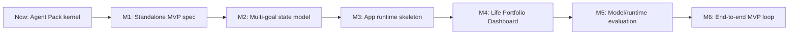

# Standalone Web/App Goal Plan

Date: 2026-06-18

This document uses Life Vision Board OS to turn the standalone Web/App product direction into a concrete execution loop.

## Goal Contract Draft

- Goal category: `project_delivery` primary, `strategy_decision` and `research_exploration` secondary.
- Original vision: Build Life Vision Board as an independent Web/App product, while keeping it portable as a plugin for Codex, Claude Code, Coze, Dify-style workflows, and custom agent runtimes.
- Clarified goal: Ship a first standalone Life Vision Board MVP that lets a user manage multiple long-running goals through a persistent Life Portfolio Dashboard, while reusing the same OS kernel that powers the Agent Pack and skill integrations.
- Objective: Build a working product path from Markdown Agent Pack to persistent Web/App experience without locking the system to one model, agent framework, or host platform.
- Success Signals:
  - SS1: Product foundation exists: standalone product spec, multi-goal state model, adapter boundary, and MVP scope are documented and accepted.
  - SS2: Technical foundation exists: a minimal app skeleton can read/write goal state records and render a Life Portfolio Dashboard.
  - SS3: Model and agent-framework evaluation exists: at least two model routes and two agent/runtime routes are tested against Life Vision Board scenarios.
  - SS4: First user loop works end to end: create goal, assess current stage, draw milestones, create stage plan, log evidence, run review.
- Observable outputs:
  - Product spec and acceptance criteria.
  - `life_portfolio` schema.
  - Minimal Dashboard prototype.
  - Adapter decision matrix.
  - Real model transcript evaluation report.
  - First end-to-end demo recording or transcript.
- Target state: A usable MVP candidate, not a polished commercial app.
- Working assumption: Use a 6-week build horizon for the first serious MVP candidate, with 7-day review cycles.
- Constraints:
  - The OS kernel must stay platform-neutral.
  - The app must not depend on Codex as the only runtime.
  - The first app should be simple enough for one builder plus AI assistance.
  - Model choices must remain replaceable.
- Guidance style: Direct mentor plus action coach.
- First review date: 2026-06-25.
- Open uncertainties:
  - Whether the first app should be local-first, cloud-first, or hybrid.
  - Whether the first orchestration runtime should be hand-rolled, LangGraph, OpenAI Agents SDK, Dify, or another framework.
  - Whether the first model route should prioritize Chinese hosted APIs, open-weight deployment, or provider-agnostic evaluation.

## Current Stage

- Stage: Agent Pack kernel is taking shape; standalone product has not started yet.
- Assessment basis:
  - `AGENT.md`, `skills/`, `schemas/`, and tests define the Life Vision Board workflow.
  - `docs/product-forms-and-integration-strategy.md` separates plugin form from standalone product form.
  - `docs/model-strategy-2026-06.md` contains an initial model strategy, but needs a current evaluation matrix and real runner.
  - No Web/App source code, app runtime, database schema, or Dashboard implementation exists yet.
- Confidence: high for current repo stage; medium for model/framework choice because external model and framework options are changing quickly.
- Strengths:
  - Clear differentiated kernel: current-position assessment, milestones, stage actions, coaching, review.
  - Good product direction: plugin distribution and standalone product can share one OS.
  - Existing scenario tests provide a seed evaluation set.
- Weaknesses:
  - State is still Markdown/YAML, not executable application schema.
  - No multi-goal portfolio model yet.
  - No real model transcript runner.
  - No Dashboard UX or app shell.
- Distance to target:
  - Gap 1: Product experience gap. The Life Portfolio Dashboard and goal detail surfaces are not specified or built.
  - Gap 2: Runtime gap. The OS exists as prompts and Markdown protocols, not as typed services, adapters, or APIs.
  - Gap 3: Evaluation gap. Model and agent framework choices are not backed by live scenario tests.

## Target Milestone Route

### Milestones

1. Product Foundation
   - Define MVP target user, scope, non-scope, core screens, and acceptance criteria.
   - Decide first deployment shape: local-first, cloud-first, or hybrid.

2. State Foundation
   - Add `life_portfolio` schema for multiple goals, priorities, paused goals, backlog, energy budget, conflicts, and review cadence.
   - Convert existing goal artifacts into app-ready JSON schema candidates.

3. Runtime Foundation
   - Create a minimal service boundary: `GoalService`, `PortfolioService`, `ReviewService`, `MemoryStore`, `ModelProvider`, `Evaluator`.
   - Keep the agent kernel reusable from plugin form and standalone form.

4. Dashboard MVP
   - Build the first app shell with Life Portfolio Dashboard, goal detail page, weekly focus view, and review view.
   - The first UI should manage state clearly before trying to be visually rich.

5. Model And Agent Runtime Evaluation
   - Build a live transcript runner using the existing scenario set.
   - Evaluate at least two model routes and two orchestration routes.

6. End-To-End MVP Loop
   - A user can create one or more goals, assess current stage, generate milestones, create actions, log evidence, and complete a review.

### Key Dependencies

- Product spec before app implementation.
- Multi-goal schema before Dashboard.
- Adapter boundary before deep model/framework lock-in.
- Live evaluation runner before choosing default model/runtime.

### Risk Points

- Overbuilding agent architecture before a real user loop exists.
- Treating the Dashboard as decoration rather than the main product surface.
- Choosing a model based on benchmark hype instead of Life Vision Board scenario performance.
- Letting plugin integrations and standalone app diverge into two separate products.

### Checkpoints

- Week 1: Spec, state model, and model/framework evaluation plan exist.
- Week 2: App skeleton reads/writes sample state and renders Dashboard from fixtures.
- Week 3: First end-to-end local loop works without real auth.
- Week 4: Live model transcript runner compares model/framework routes.
- Week 5: Dashboard supports evidence log and review adjustment.
- Week 6: MVP demo is ready for one real external tester.

## First 7-Day Stage Plan

Current focus: turn the broad Web/App ambition into a buildable MVP foundation.

| Day | Success Signal | Focus | Task | Expected Output | Coach Check |
| --- | --- | --- | --- | --- | --- |
| 1 | SS1 | Product boundary | Write standalone MVP spec: target user, scope, non-scope, screens, acceptance criteria. | `docs/specs/standalone-mvp-spec.md` | Does the spec avoid becoming a generic productivity app? |
| 2 | SS1 | State model | Draft `life_portfolio` schema and JSON examples for 3 active goals, 1 paused goal, and 1 backlog item. | `schemas/life-portfolio.schema.md` | Can the Dashboard be rendered from this state alone? |
| 3 | SS3 | Model evaluation | Update model strategy with current GLM-5.2, DeepSeek-V4, Qwen, and hosted fallback routes. | Updated model decision matrix | Are we choosing test candidates, not declaring a winner too early? |
| 4 | SS3 | Agent runtime evaluation | Compare LangGraph, OpenAI Agents SDK, Dify, CrewAI, Microsoft Agent Framework, and a hand-rolled orchestrator. | Runtime decision matrix | Which option best supports persistence, review loops, and portability? |
| 5 | SS2 | App architecture | Define app modules, API boundaries, storage choice, and fixture-driven MVP architecture. | `docs/architecture/standalone-app-architecture.md` | Is the architecture simple enough for a one-person build? |
| 6 | SS2 | Dashboard prototype prep | Create sample fixture data and UI wireframe notes for Dashboard, goal detail, and review view. | `fixtures/` plan or fixture doc plus wireframe brief | Can a frontend be built directly from this artifact? |
| 7 | SS4 | Review | Review outputs, decide the first implementation slice, and create the next 7-day build plan. | Review note and next sprint plan | Did the week reduce uncertainty or just produce documents? |

## Current Model And Framework Exploration Notes

These are current research anchors, not final decisions.

### Model Candidates

- GLM-5.2: Z.ai/Hugging Face materials state that GLM-5.2 is available, with public weights and local deployment support through frameworks such as Transformers, vLLM, SGLang, xLLM, and ktransformers. This makes it a serious evaluation candidate for Chinese-first long-horizon goal-support and coding-heavy workflows.
- DeepSeek-V4 Preview: DeepSeek's official release notes describe open-sourced Pro and Flash variants with 1M context. This makes it worth testing for long-context goal history, review summaries, and agentic planning.
- Qwen route: keep as a default open-stack baseline because of Chinese capability, ecosystem maturity, and deployment breadth.
- Hosted fallback: keep at least one hosted model route for product validation before self-hosting economics are understood.

### Agent / Runtime Candidates

- LangGraph: strong candidate for durable, stateful, long-running agent workflows.
- OpenAI Agents SDK: lightweight and provider-agnostic enough to test as a clean orchestration layer, especially if early app code is TypeScript or Python.
- Dify: useful as an integration/prototyping surface, especially for workflows, RAG, model management, and non-code iteration.
- CrewAI: useful for role-based multi-agent workflows, but may be more than the first MVP needs.
- Microsoft Agent Framework: worth tracking for Python/.NET and enterprise-grade state/telemetry patterns, but likely not first choice unless the product leans into Microsoft ecosystem.
- Hand-rolled orchestrator: still a valid first MVP route if the app needs strict control over state transitions and review gates.

## Source Anchors

- GLM-5.2 blog: https://huggingface.co/blog/zai-org/glm-52-blog
- GLM-5.2 FP8 model card: https://huggingface.co/zai-org/GLM-5.2-FP8
- DeepSeek V4 release: https://api-docs.deepseek.com/news/news260424
- DeepSeek-V4-Pro model card: https://huggingface.co/deepseek-ai/DeepSeek-V4-Pro
- LangGraph overview: https://docs.langchain.com/oss/python/langgraph/overview
- LangGraph GitHub: https://github.com/langchain-ai/langgraph
- OpenAI Agents SDK docs: https://developers.openai.com/api/docs/guides/agents
- OpenAI Agents SDK Python: https://github.com/openai/openai-agents-python
- Dify GitHub: https://github.com/langgenius/dify
- CrewAI docs: https://docs.crewai.com/
- Microsoft Agent Framework overview: https://learn.microsoft.com/en-us/agent-framework/overview/

## Immediate Next Action

Create the standalone MVP spec first. The spec should decide:

1. Who the first user is.
2. What the MVP must do.
3. What it explicitly will not do.
4. What data state the Dashboard must render.
5. What counts as a successful first demo.

